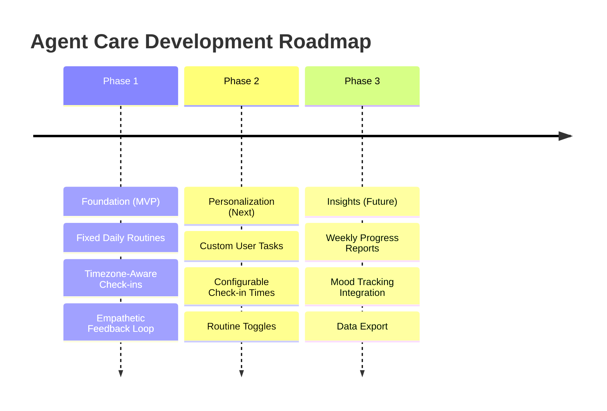

<h1> Agent Care </h1>

<h4>Agent Care is a specialized Telegram companion designed for NEETs and individuals navigating the heavy fog of a depressive episode.</h4>

 <!-- Replace with your actual deployment URL -->
 <!-- Update version and link as needed -->

---

Agent Care is a specialized Telegram companion designed for NEETs and individuals navigating the heavy fog of a depressive episode. 

When you're trapped in a long-term rut and even basic daily tasks feel insurmountable, this bot provides a low-friction way to start building momentum. It focuses on gentle, incremental goal-setting and consistent check-ins to help you slowly reclaim your sense of agency and re-engage with life at your own pace. By acknowledging the immense difficulty of simply getting started, Agent Care acts as a judgment-free accountability partner for those who need a bridge back to their own potential.

---
 
## Tech Stack
 
- **Language** — Go 1.22
- **Telegram** — [telebot v3](https://gopkg.in/telebot.v3)
- **Database** — PostgreSQL via [Supabase](https://supabase.com)
- **ORM** — [sqlx](https://github.com/jmoiron/sqlx)
- **Migrations** — [goose](https://github.com/pressly/goose)
- **Timezone Detection** — [bradfitz/latlong](https://github.com/bradfitz/latlong)
- **Env** — [godotenv](https://github.com/joho/godotenv)
 
---

## Roadmap

Below is the planned evolution of Agent Care, moving from a structured MVP to a highly personalized companion.

### 🌱 Phase 1: The Foundation (Current MVP)
- [x] Pre-configured, low-friction check-ins (Sunlight, Meals, Exercise, Morning/Night routines).
- [x] Timezone-aware scheduling based on user location.
- [x] Non-judgmental feedback loops (Positive reinforcement & setback support).
- [x] Guardrails against notification fatigue (Auto-expiring buttons, duplicate-message protection).

### 🛠️ Phase 2: Personalization (Up Next)
- [ ] **Custom Tasks:** Allow users to define their own micro-habits and goals.
- [ ] **Custom Schedules:** Let users adjust check-in times to fit unconventional sleep schedules.
- [ ] **Toggle Routines:** Ability to mute or opt-out of specific default check-ins.
- [ ] **Timezone Updates:** Allow manual overriding/updating of timezones.

### 📈 Phase 3: Insights & Reflection (Future)
- [ ] **Gentle Analytics:** Weekly/Monthly summaries of consistency without gamification pressure.
- [ ] **Mood Tracking:** Simple integration to correlate task completion with overall mood.
- [ ] **Data Export:** Optional export of check-in history for personal reflection or therapy sessions.

---
## Support

If you encounter any issues, have feature requests, or just want to discuss the project, we are here to help.

- **Issues & Bugs:** Please open an issue on our [GitHub Issues](https://github.com/pnpancholi/agent-care-tg/issues) page.
- **Direct Contact:** You can reach out directly on X (Twitter) [@knowpradhumna](https://x.com/knowpradhumna).

*Note: Agent Care is designed as a gentle companion tool, not a medical device. If you or someone you know is struggling with a severe depressive episode or mental health crisis, please consider reaching out to a local mental health professional or crisis lifeline.*

---
## Contributing

Contributions are always welcome! Whether it's a bug fix, a new feature, or a documentation improvement, your help is appreciated.

**Our Philosophy:**
- **Meaningful Contributions:** We care about changes that genuinely improve the experience for our users.
- **Simplicity First:** Agent Care is designed to be low-friction and simple. Please ensure new features align with this focused approach rather than adding unnecessary bloat.
- **AI/LLM Usage:** We are neutral on how you write your code. Whether you write every line by hand or use AI tools to assist you, what matters is the quality, readability, and intent behind the pull request.

**How to Contribute:**
1. Fork the project.
2. Create your feature branch (`git checkout -b feature/AmazingFeature`)
3. Commit your changes (`git commit -m 'Add some AmazingFeature'`)
4. Push to the branch (`git push origin feature/AmazingFeature`)
5. Open a Pull Request.

*Please open an issue first to discuss any major changes before submitting a PR to ensure it aligns with the project's roadmap.*
